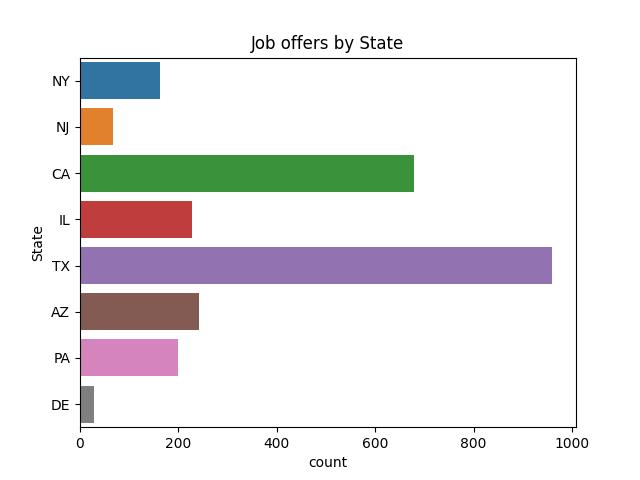

## The Economy
This project aims to gain insight into the job market for analyst roles such as data analyst, business analyst, and others, by generating an ETL, EDA, and CDA  pipeline. This research will help us current data analysts to evaluate the salary outcome of data analysts the impact of a company rating on salary and also jobs and salaries offered by sectors and states. This insight will also be beneficial to The Knowlege House and future data analyst fellows in their search for Data roles. The project is built using PostgresSQL, sqlalchemy, sklearn, sklearn.linear_model,sklearn.metrics, sklearn.tree, tableau, and python’s libraries such as pandas, matplotlib, numpy and seaborn. 

## Methodology
To start we had to clean the CVS file, using Python functions and libraries, then dropped all the null values and changed some of the data types. We saved the new and clean file into the data folder as clean_data.csv. In addition, after cleaning we created a schema and wrote a function that will open the schema in an aws database. Moreover, using SQLAlchemy we extract the data from the database and perform EDA and then CDA for prediction by doing a linear regression, lasso regression, and a decision tree. Lastly, using the information we gained from the EDA and CDA we made a Tableau visualization to display insight from the data.  

## Visuals & Results

 

This visual illustrates the number of jobs offered by states and it's a bit surprising to see that Texas is the state that offers the most data or business analyst jobs compared to states such as California and New York. This could mean that lot of companies are installing themselves in the south such as Texas and Arizona, and candidates looking for these jobs should be prepared to relocate. 

This box plot demonstrates the average salaries in different states. Based on this observation states such as California, New York, and Illinois still offer a higher salary despite Texas and Arizona being the states that are offering the most jobs. 

This bar graph displays the average salaries by sector and it is interesting to see sectors such as media, retail, manufacturing, IT and health care with very good average salaries because these are sectors that many people will tend to work in however some will not know that a sector like retail does use data or business analyst. Usually, people only tend to apply to only tech sectors but this demonstrates that there are many sectors that need and use analysts. 

This hisplot shows the minimum and maximum salary. Based on the observation the mode of the minimum salary is at 52k and the mean is a little higher therefore one can negotiate for a better salary, and mode of the maximum is around 85k and the mean is close to 100k. In both these plots they are right skewed and not normally distributed, maybe by removing outliers, we could get a normal distribution.

https://public.tableau.com/app/profile/ari.de.la.mar/viz/ECONPROJECT_16867776094300/Dashboard2?publish=yes 
